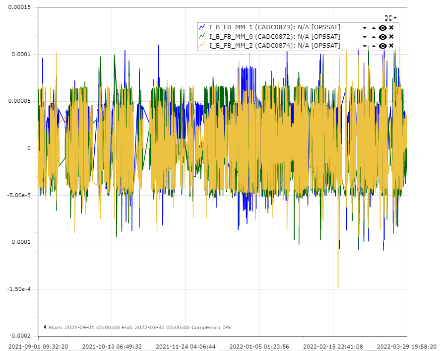

# Magnetometer Filter Plugin
- Magnetometer measurements on-board OPS-SAT have historically contained spikes that need to be discarded.
- We can train classification models so to detect these outliers.
- The datapool parameters used as training data are `CADC0872`, `CADC0873`, and `CADC0874` for cADCS magnetometer values.

## Historical Reference
- Sample useful range of dates would be September 2021 to March 2022.
- The most days without any spikes were around the second half of November.
- Generally the spikes we bother filtering out are those that are not within the `-5e-5 < x < 5e-5` range.



## Sample Requests
The Magnetometer Filter Plugin is used to train a model in either the 1D input space or 3D input space using as training data the magnetometer dipole moment measurements. The following API request is invoked to enable the training data feed subscription:

```
http://<SUPERVISOR_HOST>:<APP_PORT>/api/v1/training/data/subscribe
```

The `labelsPlugin` payload property is set to the `MagnetometerFilterSingleDipoleMoment` or `MagnetometerFilterAllDipoleMoment` extension point implementation in the `MagnetometerFilterPlugin` plugin class to determine and return the expected labels:
- `MagnetometerSingleDipoleMomentFilter`: used to train a model in 1D input space for a single dipole moment training input (x, y, OR z).
- `MagnetometerAllDipoleMomentFilter`: used to train a model in 3D input space with all dipole moments as traing input (x, y, AND z).

### Dipole Moment X
Training in the 1D input space using the dipole moment X set in the `CADC0872` datapool parameter:

```json
{
    "expId": 100,
    "datasetId": 1,
    "iterations": 10,
    "interval": 2,
    "labelsPlugin": "esa.mo.nmf.apps.saasyml.plugins.MagnetometerFilterPlugin.MagnetometerFilterSingleDipoleMoment",
    "params": ["CADC0872"]
}
```

### Dipole Moment Y
Training in the 1D input space using the dipole moment Y set in the `CADC0873` datapool parameter:

```json
{
    "expId": 101,
    "datasetId": 1,
    "iterations": 10,
    "interval": 2,
    "labelsPlugin": "esa.mo.nmf.apps.saasyml.plugins.MagnetometerFilterPlugin.MagnetometerFilterSingleDipoleMoment",
    "params": ["CADC0873"]
}
```

### Dipole Moment Z
Training in the 1D input space using the dipole moment Z set in the `CADC0874` datapool parameter:

```json
{
    "expId": 102,
    "datasetId": 1,
    "iterations": 10,
    "interval": 2,
    "labelsPlugin": "esa.mo.nmf.apps.saasyml.plugins.MagnetometerFilterPlugin.MagnetometerFilterSingleDipoleMoment",
    "params": ["CADC0874"]
}
```

### Dipole Moments X, Y, and Z
Training in the 3D input space using the dipole moments X, Y, and Z set in the `CADC0872`, `CADC0873`, and `CADC0874` datapool parameters, respectively:

```json
{
    "expId": 103,
    "datasetId": 1,
    "iterations": 10,
    "interval": 2,
    "labelsPlugin": "esa.mo.nmf.apps.saasyml.plugins.MagnetometerFilterPlugin.MagnetometerFilterAllDipoleMoment",
    "params": ["CADC0872", "CADC0873", "CADC0874"]
}
```
